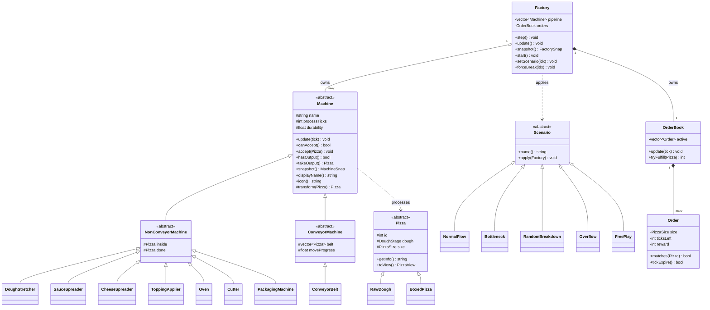
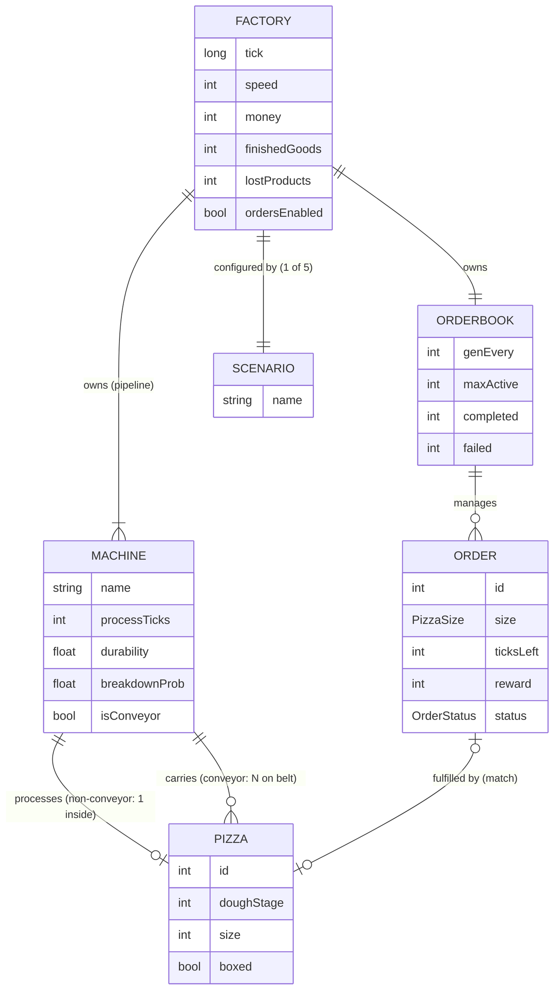

# Zzapi — 피자 공장 시뮬레이션 설계 문서

> EC5209 OOP with C++ — Factory Simulation
> 이 문서는 **모델 레이어(백엔드)** 설계와, controller/view를 붙이는 방법을 정의한다.

---

## 1. 큰 그림

```
┌─────────────────────────┐   FactorySnap (읽기)    ┌──────────────────────────┐
│   View  (ui/, ImGui)    │ ◄────────────────────── │  Factory (models/)       │
│   - snapshot만 그림      │                          │  - Machine* 소유          │
│   - 버튼은 cmd에 표시만   │   FactoryCmd (명령)      │  - 틱마다 시뮬 진행        │
└─────────────────────────┘ ──────────────────────► └──────────────────────────┘
              ▲                                                   ▲
              └────────────── Controller (controllers/) ─────────┘
                     cmd 읽어 factory 제어 메서드 호출
```

**핵심 규칙**
1. View는 백엔드 타입(`Machine`, `Factory`)을 **include하지 않는다.** 오직 `bridge.h`만.
2. View ↔ 백엔드는 **값 구조체**(`bridge.h`)로만 주고받는다. 포인터 전달 없음.
3. View는 **항상 한 프레임 뒤** — 지난 스냅샷으로 그리고, 명령은 다음 틱에 반영된다.

---

## 2. 파일 구조

```
src/
├── bridge.h                  UI↔백엔드 경계 계약 (순수 데이터, 양쪽이 공유)
├── models/                   ← 백엔드 (완성). ImGui 무의존.
│   ├── pizza.{h,cpp}            Pizza(추상) → RawDough / BoxedPizza
│   ├── machine.{h,cpp}          Machine(추상)→NonConveyor/Conveyor→concrete 8종
│   ├── factory.{h,cpp}          Factory: 집합체 모델 + 진입점
│   ├── order.{h,cpp}            Order / OrderBook (주문·보상·마감)
│   └── scenario.{h,cpp}         Scenario(추상) + NormalFlow/Bottleneck/RandomBreakdown/Overflow/FreePlay
├── controllers/              ← 동료 담당 (cmd → factory 제어)
├── views/                    ← 동료 담당 (snapshot → ImGui)
└── main.cpp                  ← 양쪽을 보는 유일한 파일
```

---

## 3. 경계 계약 — `bridge.h`

### 백엔드 → UI : 읽기 전용 스냅샷
```cpp
struct PizzaView   { int id, doughStage, size; bool sauce, cheese, hasTopping, cut, boxed; };
struct SlotView    { bool occupied; PizzaView pizza; };
struct ConveyorSnap{ vector<SlotView> slots; float moveProgress; };  // 0..1 보간용

struct MachineSnap {
    int id; string name, icon;        // 이름/아이콘은 백엔드가 채워줌 (dynamic_cast 불필요)
    MachineState state;               // IDLE/WORKING/BROKEN/OFF → 색상
    float healthPct, progressPct;     // ProgressBar
    bool  hasPizzaInside; PizzaView pizzaInside;   // 머신 안 피자
    bool  isConveyor; ConveyorSnap conveyor;       // 벨트일 때만 유효
};
struct OrderSnap   { int id; string desc; int ticksLeft, reward; };

struct FactorySnap {
    long tick; bool running; int speed; int scenario;
    vector<string>      scenarioNames;   // 드롭다운 항목
    vector<MachineSnap> machines;
    vector<OrderSnap>   orders;
    bool                ordersEnabled;   // 게임모드일 때만 true (그 외 시나리오는 주문 OFF)
    vector<string>      eventLog;        // 타임스탬프 포함
    int money, finishedGoods, wipCount, totalBreakdowns, lostProducts;
};
```

### UI → 백엔드 : 명령 (한 프레임만 true)
```cpp
struct FactoryCmd {
    bool start, pause, reset;
    int  speed;            // 1..5
    int  scenario;         // -1 = 변경 없음
    int  selectedMachine;  // Inspector 대상
    bool forceBreak, instantRepair;
};
```

---

## 4. 동료가 호출하는 백엔드 API (`factory.h`)

| 하고 싶은 것 | 호출 |
|---|---|
| 매 프레임 시뮬 진행 | `factory.update()` (running이면 speed틱) |
| 한 틱만 진행 | `factory.step()` |
| 시작 / 정지 / 리셋 | `factory.start()` / `pause()` / `reset()` |
| 배속 변경 | `factory.setSpeed(1..5)` |
| 시나리오 변경 | `factory.setScenario(idx)` (바뀌었을 때만 로드) |
| 강제 고장 / 즉시 수리 | `factory.forceBreak(idx)` / `repair(idx)` |
| 화면 데이터 | `factory.snapshot()` → `FactorySnap` |

> 머신 객체에 **직접 접근하지 않는다.** 위 메서드 + snapshot으로 충분하다.

### Controller 스켈레톤 (예시)
```cpp
// cmd → factory 제어 메서드 매핑
void FactoryController::applyCmd(const FactoryCmd& cmd) {
    if (cmd.scenario >= 0) m_factory->setScenario(cmd.scenario);
    if (cmd.start)  m_factory->start();
    if (cmd.pause)  m_factory->pause();
    if (cmd.reset)  m_factory->reset();
    m_factory->setSpeed(cmd.speed);
    if (cmd.forceBreak)    m_factory->forceBreak(cmd.selectedMachine);
    if (cmd.instantRepair) m_factory->repair(cmd.selectedMachine);
}
```

### main.cpp (양쪽을 보는 유일한 곳)
```cpp
Factory factory;
FactoryCmd cmd;
// 루프 안:
renderUI(factory.snapshot(), cmd);   // 1. 스냅샷 그림 + 버튼이 cmd에 표시
controller.applyCmd(cmd); cmd = {};  // 2. 명령 전달 후 즉시 비움
factory.update();                    // 3. 백엔드가 틱 진행
```

### 필요한 ImGui 창 5개
- **Simulation Control**: Start/Pause/Reset, 배속 슬라이더, 시나리오 드롭다운, 틱 카운터
- **Factory Floor**: 머신 배치도. `state`로 색상, 벨트는 `moveProgress`로 피자 보간 이동
- **Inspector**: 선택 머신의 state/health/progress + Force Break/Instant Repair
- **Event Log**: `eventLog` 스크롤 + Clear
- **Statistics**: money / finishedGoods / wipCount / totalBreakdowns / lostProducts

---

## 5. UML 클래스 다이어그램



---

## 6. ER 다이어그램 (과제 3.2 대응)

> 엔티티(객체) 간 관계 + 다중도. 상속 구조(Machine/Pizza/Scenario 서브타입)는 §5 UML 참고.
> 주문/경제(ORDERBOOK·ORDER)는 게임모드(Free Play)에서만 활성 — `FACTORY.ordersEnabled`.



---

## 7. 과제 요구사항 충족 매핑

| 과제 요구 | 충족 위치 |
|---|---|
| 추상 루트 + 2단계 상속 | `Machine` → `NonConveyor/Conveyor` → concrete |
| 시뮬 루프에 타입 분기 없음 | `Factory::step()`: `for (Machine* m : pipeline) m->update(tick)` |
| 새 머신 = 루프/UI 0줄 수정 | 머신이 `displayName/icon/snapshot` 자체 제공 |
| public 데이터 멤버 0개 | 전 클래스 private/protected |
| 추상 product + 시작/끝 2개 | `Pizza` → `RawDough` / `BoxedPizza` |
| UI/백엔드 분리 | `bridge.h` snapshot/cmd, View는 백엔드 무의존 |
| 시나리오 드롭다운 | `Scenario` 다형성 + `scenarioNames` 스냅샷 |
| Event Log / Statistics | `FactorySnap.eventLog` / 통계 필드 |
```
