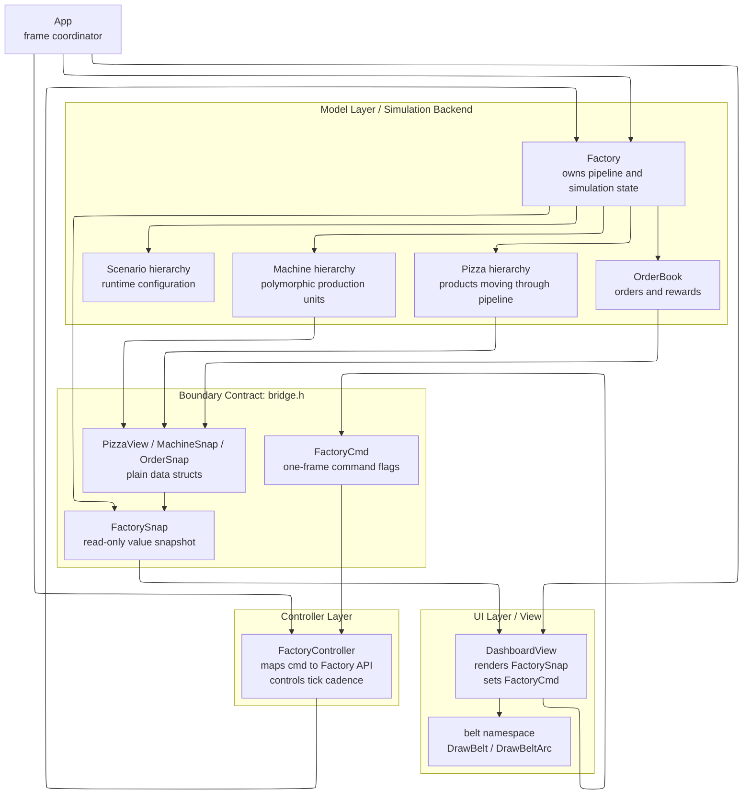
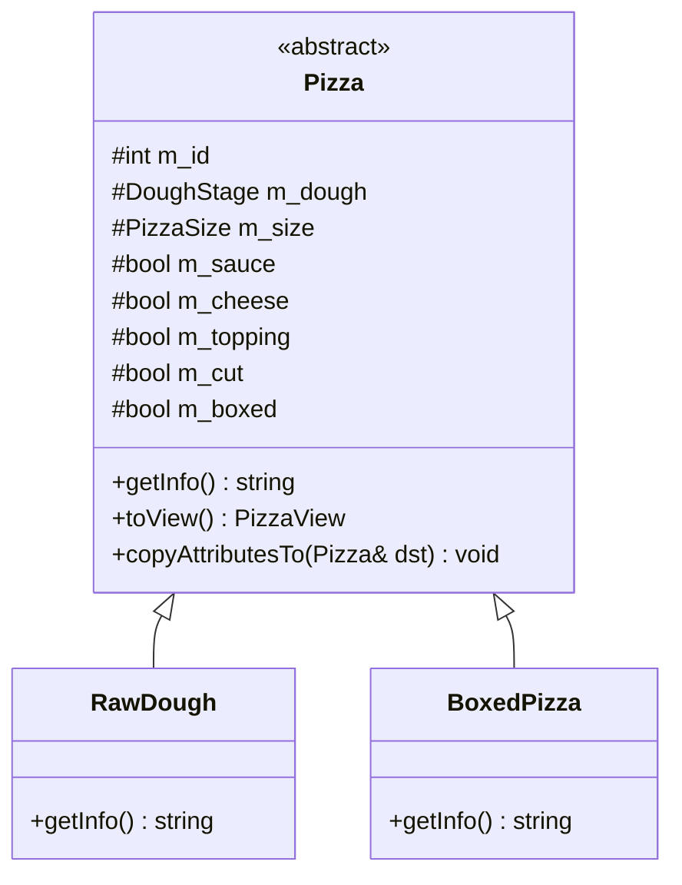
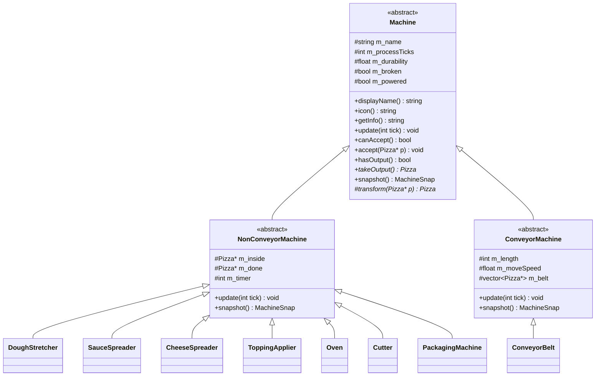
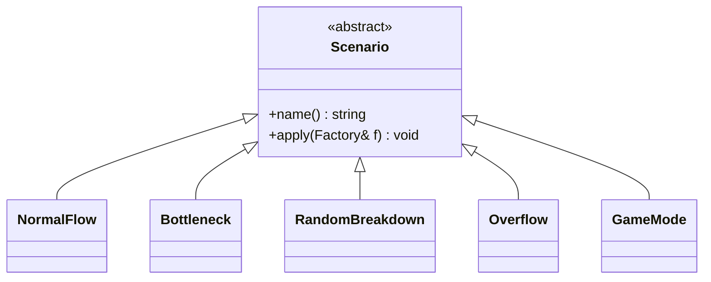
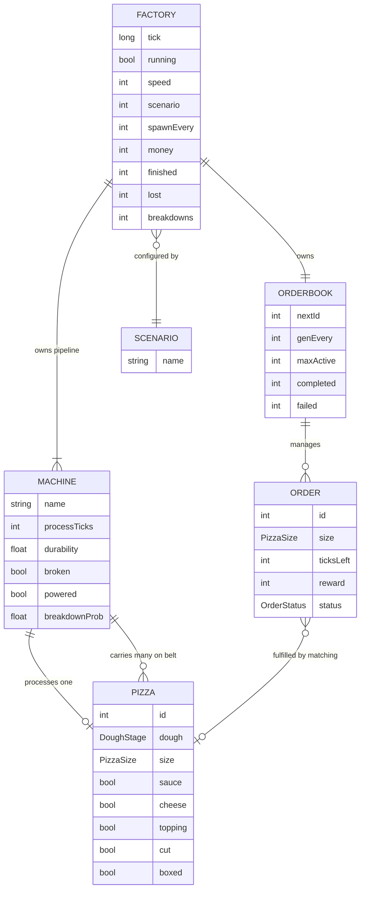
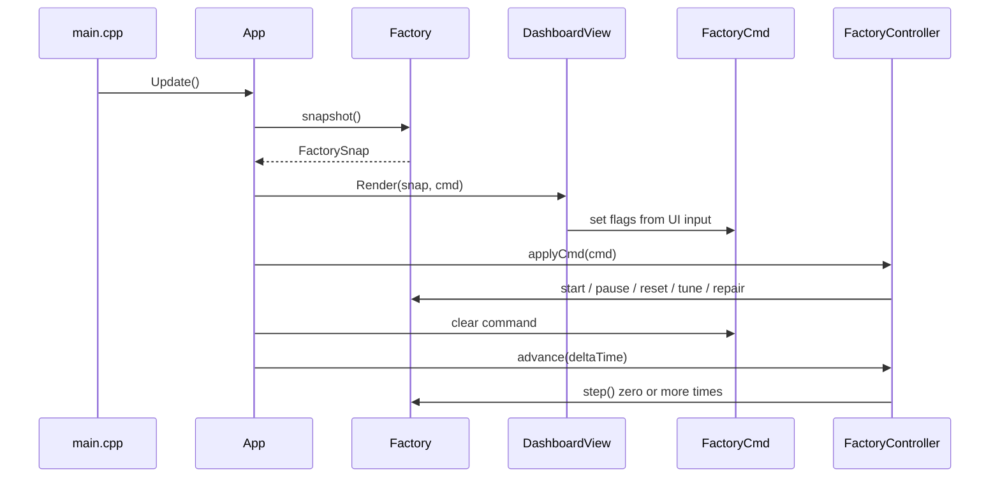
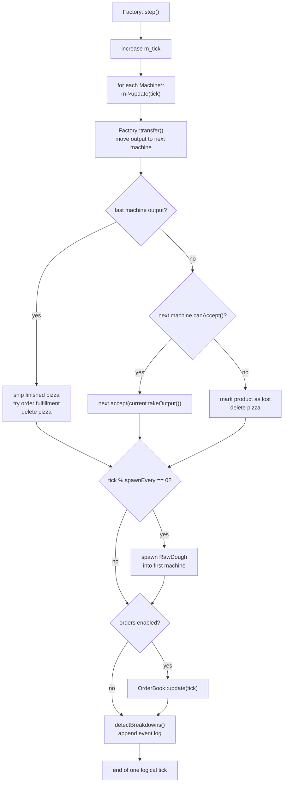
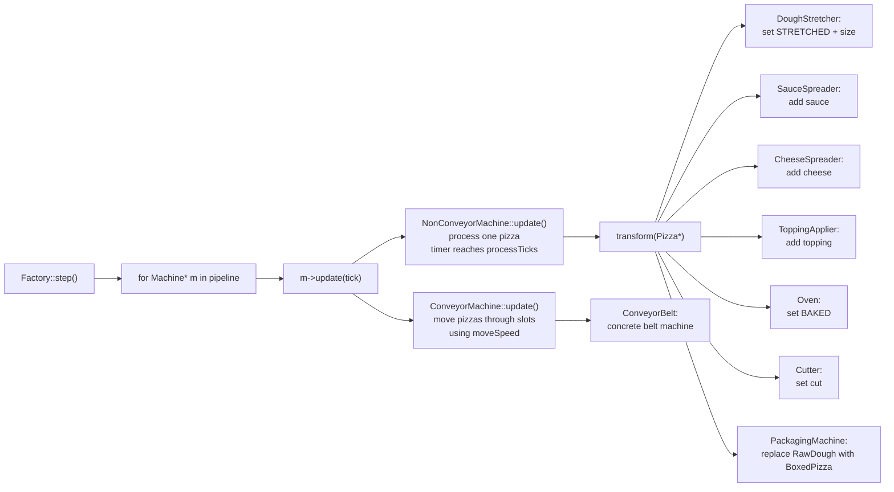
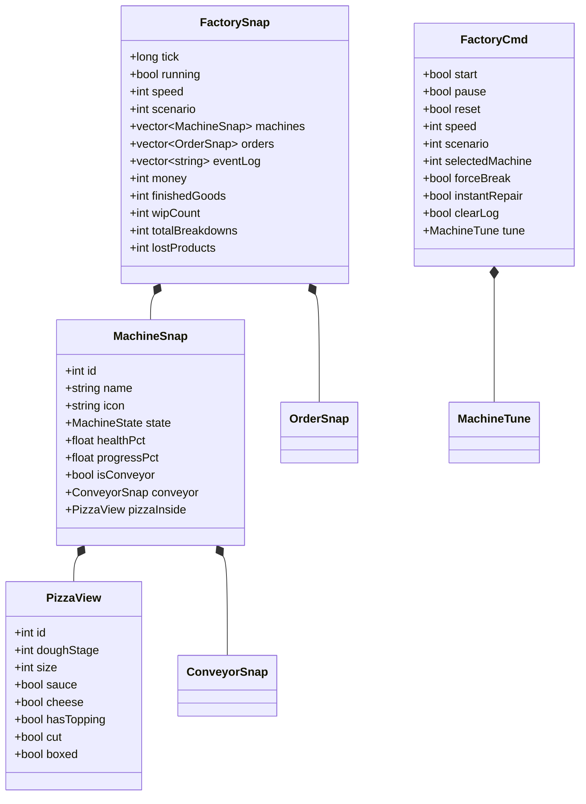

# Zzapi OOP Architecture Diagrams

> Purpose: explain the class hierarchy, object relationships, and runtime behavior of the pizza factory simulator.

---

## 1. Overall Architecture

`App` coordinates the UI, controller, and factory once per frame. `DashboardView` never accesses real `Machine` or `Pizza` objects; it only renders a copied value snapshot called `FactorySnap`. User input is written into `FactoryCmd` as one-frame command flags, and `FactoryController` translates those flags into public `Factory` API calls. This keeps the UI and simulation backend decoupled through `bridge.h`.

**Key OOP point:** the model owns behavior and state, while the view receives only data-transfer objects. This is a clear separation of responsibilities.

---

## 2. Main Class Hierarchy

The project has three important inheritance structures. First, `Pizza` is an abstract product, specialized into the starting product `RawDough` and the final product `BoxedPizza`. Second, `Machine` is an abstract production unit, split into `NonConveyorMachine`, which processes one pizza at a time, and `ConveyorMachine`, which carries pizzas through belt slots. Third, `Scenario` is an abstract configuration strategy; each concrete scenario changes the factory by calling the public configuration API of `Factory`.

**Key OOP point:** the simulation loop depends on abstract base classes, not concrete classes. This demonstrates abstraction and polymorphism.

---

## 3. Object Relationship Diagram

`Factory` is the aggregate root of the simulation. It owns a pipeline of many `Machine` objects and, in game mode, also owns an `OrderBook`. A `Machine` either processes a pizza directly or carries pizzas in conveyor slots before passing them to the next stage. `OrderBook` manages many `Order` objects and calculates rewards when a finished `Pizza` matches an active order.

**Key OOP point:** ownership is centralized in `Factory`, while each object still keeps its own responsibilities. This supports encapsulation and keeps object lifetimes understandable.

---

## 4. Runtime Frame Flow

Every frame runs through `App::Update()`. First, `Factory` creates a read-only `FactorySnap`, and `DashboardView` renders that snapshot. If the user clicks buttons or changes sliders, the view does not mutate the model directly; it only writes command flags into `FactoryCmd`. Then `FactoryController` reads the command and calls the public API of `Factory`. Finally, based on accumulated real time, `Factory::step()` may be executed zero or more times.

**Key OOP point:** the view is passive with respect to the model. User intent is represented as a command object and applied by the controller.

---

## 5. Simulation Tick Flow

`Factory::step()` represents one logical simulation tick. It first calls `update()` on every machine. The important part is that `Factory` does not inspect the concrete machine type. All machines are stored as `Machine*`, and each concrete class performs its own version of `update()`. Then the factory transfers outputs from back to front. If the next machine cannot accept an item, the product is counted as lost. When a pizza leaves the final machine, it is shipped, and in game mode the order reward is also calculated.

**Key OOP point:** polymorphism removes type-specific branching from the simulation loop.

---

## 6. Machine Polymorphism

All machines share the `Machine` interface, but their internal behavior is different. `NonConveyorMachine` stores one pizza internally and calls `transform()` when its processing timer finishes. `ConveyorMachine`, on the other hand, moves pizzas through multiple belt slots. `Factory` does not need to know this difference; it only uses common methods such as `update()`, `canAccept()`, and `takeOutput()`.

**Key OOP point:** new machine behavior can be added by subclassing, while the factory loop stays stable.

---

## 7. Boundary Data Objects

The structs in `bridge.h` are plain data objects without behavior. `FactorySnap` is a read-only copy sent from the backend to the UI, while `FactoryCmd` is a command object sent from the UI to the backend. Since the UI only uses these values, it does not depend on the internal implementation of `Machine`, `Pizza`, or `Factory`.

**Key OOP point:** this is an explicit boundary between layers, reducing coupling and protecting encapsulation.

---

## 8. Summary

This project is a C++ simulator that models a pizza factory using object-oriented design. `Factory` is the central simulation object that manages the machine pipeline, orders, statistics, and event logs. Each machine inherits from the abstract `Machine` class, and its behavior is handled polymorphically. Therefore, `Factory::step()` does not check concrete machine types; it only calls the common interface through `Machine*`. The UI does not directly manipulate model objects. Instead, it communicates with the backend only through `FactorySnap` and `FactoryCmd`. This design demonstrates abstraction, inheritance, polymorphism, encapsulation, and layer separation.
