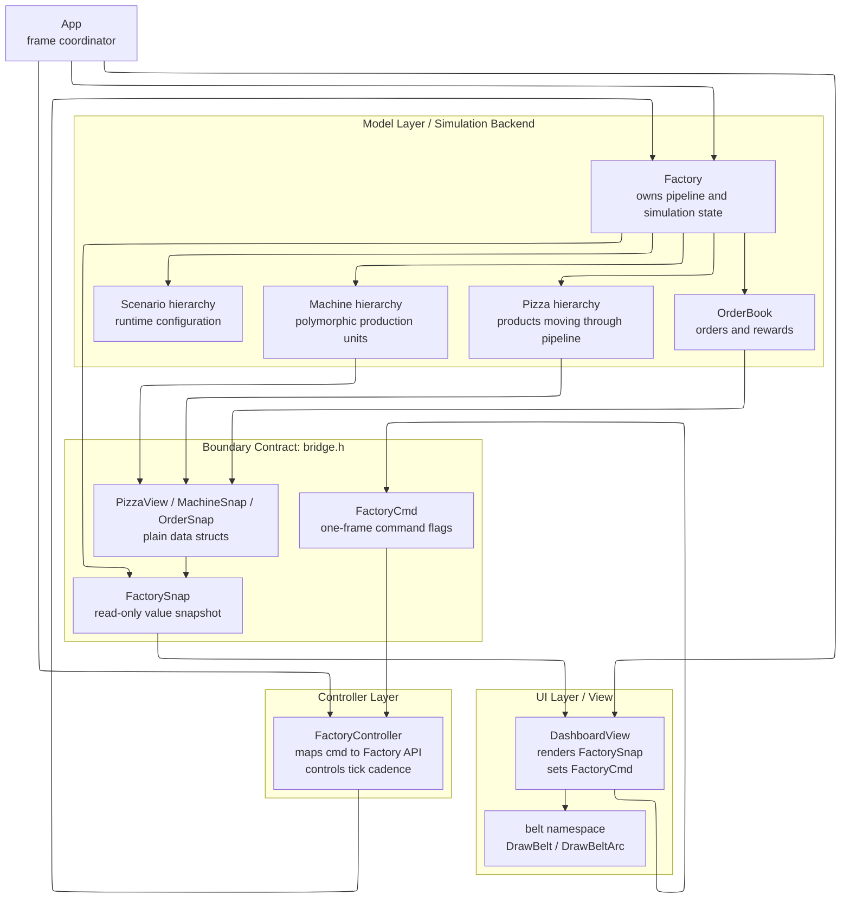
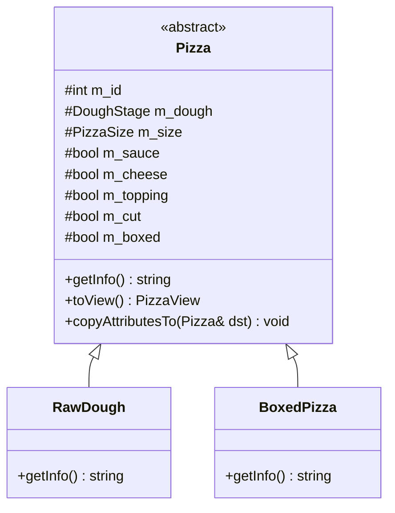
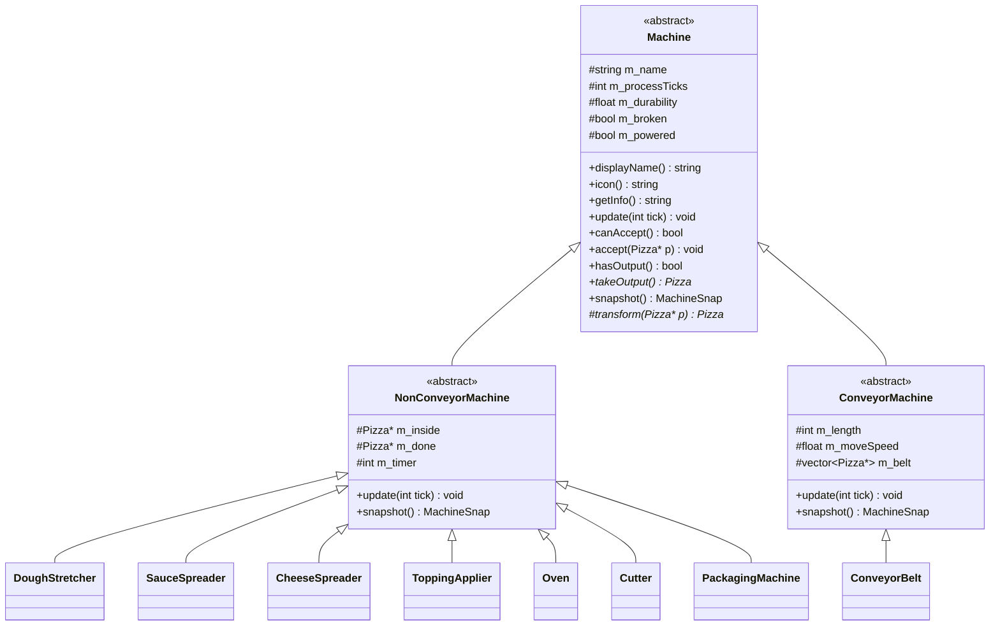
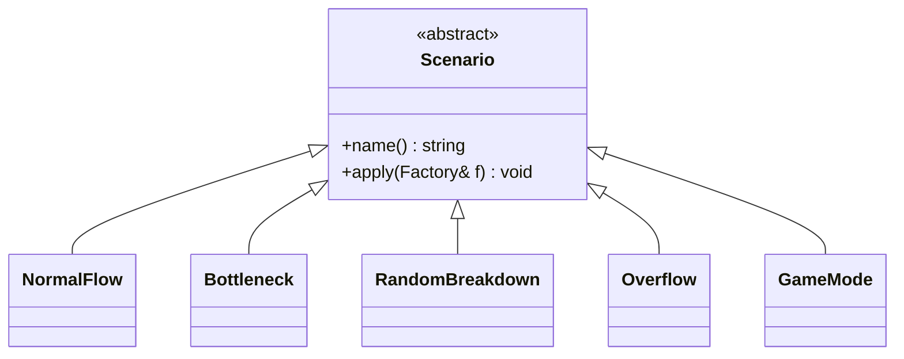
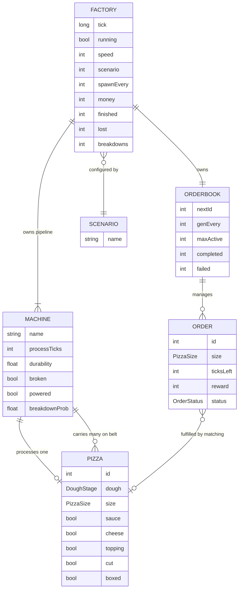
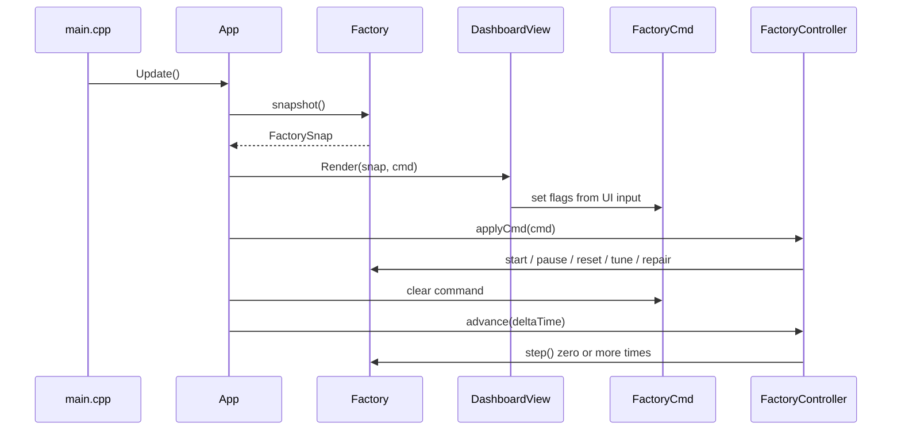
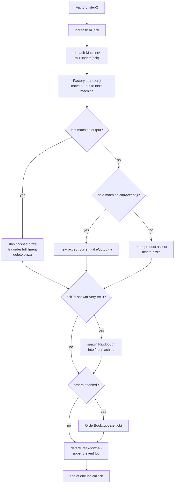
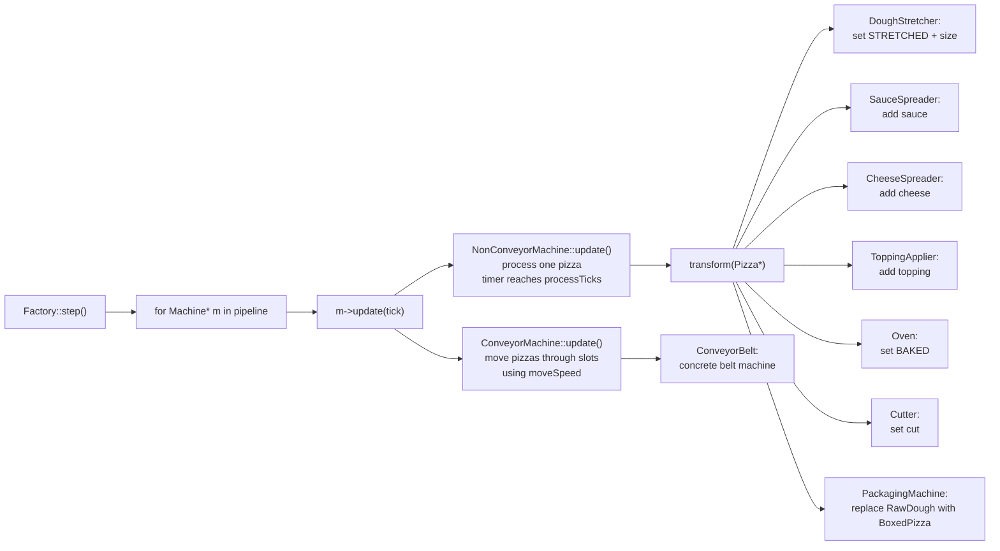
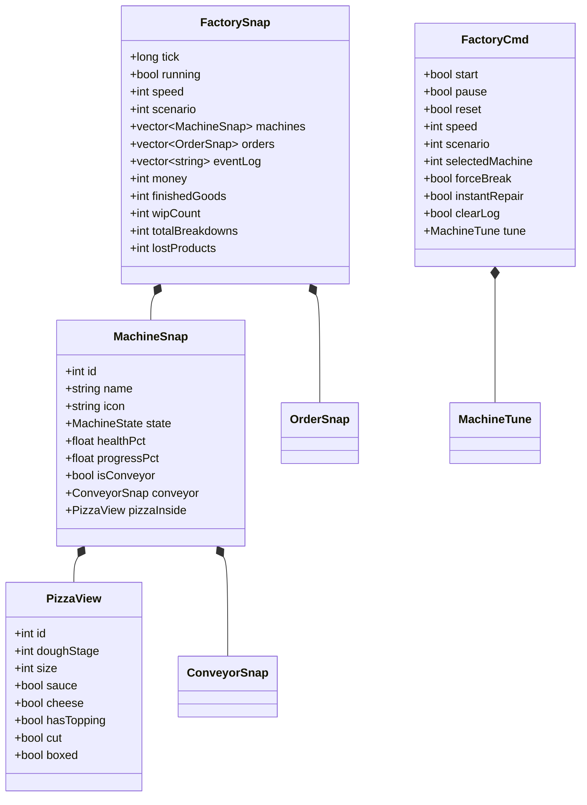

# Zzapi OOP Architecture Diagrams

> Purpose: explain the class hierarchy, object relationships, and runtime behavior of the pizza factory simulator.
>
> 목적: 피자 공장 시뮬레이터의 클래스 계층, 객체 관계, 실행 구조를 객체지향 관점에서 설명한다.

---

## 1. Overall Architecture / 전체 아키텍처

Korean:
`App`은 매 프레임 UI, Controller, Factory를 연결하는 조정자이다. `DashboardView`는 실제 `Machine` 또는 `Pizza` 객체를 직접 보지 않고, `FactorySnap`이라는 값 복사 스냅샷만 렌더링한다. 사용자의 버튼 입력은 `FactoryCmd`에 한 프레임짜리 명령으로 기록되고, `FactoryController`가 이 명령을 `Factory`의 공개 메서드 호출로 변환한다. 이 구조 덕분에 UI와 시뮬레이션 백엔드는 `bridge.h`를 경계로 분리된다.

English:
`App` coordinates the UI, controller, and factory once per frame. `DashboardView` never accesses real `Machine` or `Pizza` objects; it only renders a copied value snapshot called `FactorySnap`. User input is written into `FactoryCmd` as one-frame command flags, and `FactoryController` translates those flags into public `Factory` API calls. This keeps the UI and simulation backend decoupled through `bridge.h`.

Key OOP point:
The model owns behavior and state, while the view receives only data-transfer objects. This is a clear separation of responsibilities.

---

## 2. Main Class Hierarchy / 주요 클래스 계층

Korean:
이 프로젝트의 핵심 상속 구조는 세 가지이다. 첫째, `Pizza`는 추상 제품이며 시작 단계인 `RawDough`와 최종 단계인 `BoxedPizza`로 구체화된다. 둘째, `Machine`은 추상 생산 장비이며, 한 번에 하나의 피자를 가공하는 `NonConveyorMachine`과 슬롯에 피자를 운반하는 `ConveyorMachine`으로 나뉜다. 셋째, `Scenario`는 공장 설정 전략을 나타내는 추상 클래스이고, 각 시나리오가 `Factory`의 설정 API를 호출해 다른 실행 조건을 만든다.

English:
The project has three important inheritance structures. First, `Pizza` is an abstract product, specialized into the starting product `RawDough` and the final product `BoxedPizza`. Second, `Machine` is an abstract production unit, split into `NonConveyorMachine`, which processes one pizza at a time, and `ConveyorMachine`, which carries pizzas through belt slots. Third, `Scenario` is an abstract configuration strategy; each concrete scenario changes the factory by calling the public configuration API of `Factory`.

Key OOP point:
The simulation loop depends on abstract base classes, not concrete classes. This demonstrates abstraction and polymorphism.

---

## 3. Object Relationship Diagram / 객체 관계도

Korean:
`Factory`는 시뮬레이션의 aggregate root이다. 여러 `Machine` 객체를 파이프라인으로 소유하고, 게임 모드에서는 `OrderBook`도 함께 관리한다. `Machine`은 피자를 직접 가공하거나 벨트 슬롯에 보관하면서 다음 단계로 넘긴다. `OrderBook`은 여러 `Order`를 관리하고, 완성된 `Pizza`가 출고될 때 주문 조건과 매칭해 보상을 계산한다.

English:
`Factory` is the aggregate root of the simulation. It owns a pipeline of many `Machine` objects and, in game mode, also owns an `OrderBook`. A `Machine` either processes a pizza directly or carries pizzas in conveyor slots before passing them to the next stage. `OrderBook` manages many `Order` objects and calculates rewards when a finished `Pizza` matches an active order.

Key OOP point:
Ownership is centralized in `Factory`, while each object still keeps its own responsibilities. This supports encapsulation and keeps object lifetimes understandable.

---

## 4. Runtime Frame Flow / 프레임 단위 실행 흐름

Korean:
매 프레임 `App::Update()`가 실행된다. 먼저 `Factory`에서 읽기 전용 `FactorySnap`을 만든 뒤, `DashboardView`가 그 스냅샷을 화면에 그린다. 사용자가 버튼이나 슬라이더를 조작하면 View는 실제 모델을 직접 수정하지 않고 `FactoryCmd`에 명령만 표시한다. 이후 `FactoryController`가 명령을 읽고 `Factory`의 공개 API를 호출한다. 마지막으로 누적된 시간에 따라 `Factory::step()`이 0번 이상 실행된다.

English:
Every frame runs through `App::Update()`. First, `Factory` creates a read-only `FactorySnap`, and `DashboardView` renders that snapshot. If the user clicks buttons or changes sliders, the view does not mutate the model directly; it only writes command flags into `FactoryCmd`. Then `FactoryController` reads the command and calls the public API of `Factory`. Finally, based on accumulated real time, `Factory::step()` may be executed zero or more times.

Key OOP point:
The view is passive with respect to the model. User intent is represented as a command object and applied by the controller.

---

## 5. Simulation Tick Flow / 시뮬레이션 한 틱 흐름

Korean:
`Factory::step()`은 논리적인 한 틱을 의미한다. 먼저 모든 머신의 `update()`를 호출한다. 여기서 중요한 점은 `Factory`가 머신의 실제 타입을 검사하지 않는다는 것이다. 모든 머신은 `Machine*`로 저장되어 있고, 각 구체 클래스가 자기 방식으로 `update()`를 수행한다. 그 다음 완성된 출력물을 뒤에서 앞으로 이동시키며, 다음 머신이 받을 수 없으면 손실로 처리한다. 마지막 머신에서 나온 피자는 출고되고, 게임 모드에서는 주문 보상 계산도 함께 수행된다.

English:
`Factory::step()` represents one logical simulation tick. It first calls `update()` on every machine. The important part is that `Factory` does not inspect the concrete machine type. All machines are stored as `Machine*`, and each concrete class performs its own version of `update()`. Then the factory transfers outputs from back to front. If the next machine cannot accept an item, the product is counted as lost. When a pizza leaves the final machine, it is shipped, and in game mode the order reward is also calculated.

Key OOP point:
Polymorphism removes type-specific branching from the simulation loop.

---

## 6. Machine Polymorphism / 머신 다형성

Korean:
모든 머신은 `Machine` 인터페이스를 공유하지만, 내부 동작은 다르다. `NonConveyorMachine`은 피자 하나를 내부에 보관하고 타이머가 끝나면 `transform()`을 호출해 피자의 상태를 바꾼다. 반면 `ConveyorMachine`은 여러 슬롯을 가진 벨트로 피자를 이동시킨다. `Factory`는 이 차이를 알 필요 없이 `update()`, `canAccept()`, `takeOutput()` 같은 공통 인터페이스만 사용한다.

English:
All machines share the `Machine` interface, but their internal behavior is different. `NonConveyorMachine` stores one pizza internally and calls `transform()` when its processing timer finishes. `ConveyorMachine`, on the other hand, moves pizzas through multiple belt slots. `Factory` does not need to know this difference; it only uses common methods such as `update()`, `canAccept()`, and `takeOutput()`.

Key OOP point:
New machine behavior can be added by subclassing, while the factory loop stays stable.

---

## 7. Boundary Data Objects / 경계 데이터 객체

Korean:
`bridge.h`의 구조체들은 메서드가 없는 순수 데이터 객체이다. `FactorySnap`은 백엔드에서 UI로 가는 읽기 전용 복사본이고, `FactoryCmd`는 UI에서 백엔드로 가는 명령 객체이다. UI는 이 값들만 사용하기 때문에 `Machine`, `Pizza`, `Factory`의 내부 구현에 의존하지 않는다.

English:
The structs in `bridge.h` are plain data objects without behavior. `FactorySnap` is a read-only copy sent from the backend to the UI, while `FactoryCmd` is a command object sent from the UI to the backend. Since the UI only uses these values, it does not depend on the internal implementation of `Machine`, `Pizza`, or `Factory`.

Key OOP point:
This is an explicit boundary between layers, reducing coupling and protecting encapsulation.

---

## 8. Short Presentation Summary / 발표용 요약

Korean:
이 프로젝트는 피자 공장을 객체지향적으로 모델링한 C++ 시뮬레이터이다. `Factory`는 전체 시뮬레이션의 중심 객체로서 머신 파이프라인, 주문, 통계, 로그를 관리한다. 각 머신은 `Machine` 추상 클래스를 상속하며, 실제 동작은 다형성으로 처리된다. 따라서 `Factory::step()`은 구체 머신 타입을 검사하지 않고 `Machine*`의 공통 인터페이스만 호출한다. UI는 실제 모델 객체를 직접 조작하지 않고, `FactorySnap`과 `FactoryCmd`를 통해서만 백엔드와 통신한다. 이 구조는 추상화, 상속, 다형성, 캡슐화, 계층 분리를 보여준다.

English:
This project is a C++ simulator that models a pizza factory using object-oriented design. `Factory` is the central simulation object that manages the machine pipeline, orders, statistics, and event logs. Each machine inherits from the abstract `Machine` class, and its behavior is handled polymorphically. Therefore, `Factory::step()` does not check concrete machine types; it only calls the common interface through `Machine*`. The UI does not directly manipulate model objects. Instead, it communicates with the backend only through `FactorySnap` and `FactoryCmd`. This design demonstrates abstraction, inheritance, polymorphism, encapsulation, and layer separation.
